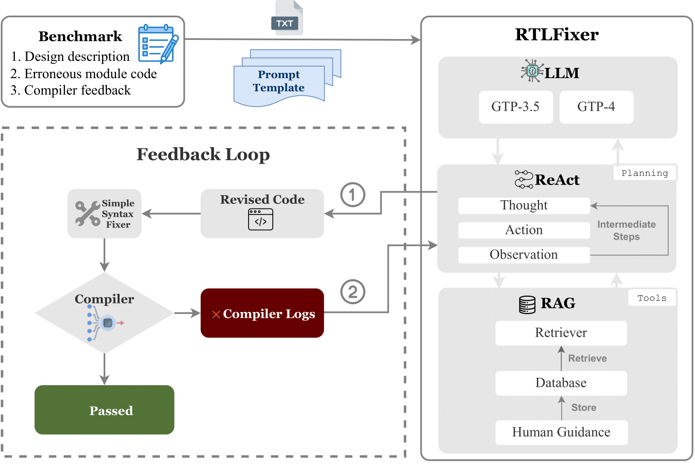

# RTLFixer: Automatically Fixing RTL Syntax Errors with Large Language Models

This repo holds the code and benchmark datasets for [RTLFixer: Automatically Fixing RTL Syntax Errors with Large Language Models](https://arxiv.org/abs/2311.16543). 




We release the VerilogEval-Syntax and VerilogEval-Simulate [here](./src/benchmarks)


### Quick Start


#### Installation

To get started:

1. Clone this repo:
```bash
$ git clone https://github.com/
```

2. Install the module dependencies into your environment:
```bash
$ pip install -r requirements.txt
```

3. Install vcdvcd and verilog-eval
```bash
$ pip install vcdvcd
$ git clone https://github.com/NVlabs/verilog-eval
$ pip install -e verilog-eval

```

4. Set `OPENAI_API_KEY` environment variable to your OpenAI API key:
```bash
$ export OPENAI_API_KEY=<your key>
```


#### Run
Run scripts:
```bash
$ cd src
$ ./scripts/run_oneshot_fix_compile.sh
```

From command line:
```bash
$ python main.py \
  --run_name "test_oneshot_compile" \
  --root_dir "exp" \
  --dataset_path ./benchmarks/verilogeval-syntax-hard.jsonl \
  --task "oneshot_fix_compile" \
  --agent_feedback "rag" \
  --language "verilog" \
  --model "gpt-3.5-turbo-16k-0613" \
  --pass_at_k "1" \
  --num_samples '1' \
  --compiler 'quartus' \
  --verbose
```


#### Tasks

 - `oneshot_fix_compile` 

 - `react_fix_compile` 

 - `react_fix_simulate` 


#### Agent Feedbacks

Each notebook allows you to specify the reflexion strategy to be used by the agents. The available reflexion strategies, which are defined in an `Enum`, include:

 - `nofeedback` - The agent is given binary feedback (failed or succeed). 

 - `feedback` - The agent is given the compiler logs as feedback.

 - `rag` - The agent is given the retrieved human guidance as feedback. 


#### Compilers

 - `iverilog` - https://github.com/steveicarus/iverilog

 - `modelsim` - https://www.intel.com/content/www/us/en/software-kit/750368/modelsim-intel-fpgas-standard-edition-software-version-18-1.html

 - `vcs` - https://www.synopsys.com/support/licensing-installation-computeplatforms/installation.html
 
 - `quartus` - https://www.intel.com/content/www/us/en/software-kit/660907/intel-quartus-prime-lite-edition-design-software-version-20-1-1-for-windows.html


### Other Notes

For all questions, contact [yundat@nvidia.com](yundat@nvidia.com)

### Cite

```bibtex
@misc{tsai2024rtlfixer,
      title={RTLFixer: Automatically Fixing RTL Syntax Errors with Large Language Models}, 
      author={Yun-Da Tsai and Mingjie Liu and Haoxing Ren},
      year={2024},
      eprint={2311.16543},
      archivePrefix={arXiv},
      primaryClass={cs.AR}
}
```
